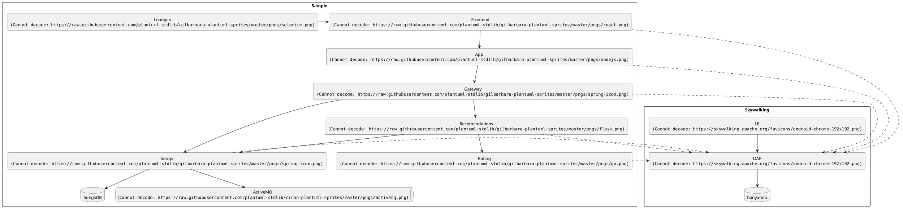

# Skywalking Copilot

A [Browser Copilot](https://github.com/abstracta/browser-copilot) that empowers the usage of applications that use [Apache Skywalking](https://skywalking.apache.org/) as observability platform.

Currently, this project only covers some basic scenarios. If you are interested in helping to evolve it we are open to contributions. 

## Requirements

* [devbox](https://www.jetpack.io/devbox)

## Setup

```bash
devbox install && devbox run install
```

Set `OPENAI_API_KEY` with proper value in [.env](./.env)

Start postgres:

```bash
devbox run postgres
```

## Development

To update to latest version of browser-copilot submodule you can use

```bash
devbox run update-git
```

To update to latest dependencies of python:

```bash
devbox run update-python
```

To add new dependencies to python:

```bash
poetry add X
```

To generate new DB migrations due to changes in database.py module:

```bash
devbox run new-migration "description"
```

To run DB migrations against the local database:

```bash
devbox run migrations
```

> the app automatically updates database with migrations when postgres service is started with devbox


## Skywalking Showcase

To try the copilot locally you can try running [Skywalking showcase](https://skywalking.apache.org/docs/skywalking-showcase/next/readme/#quick-start) locally.

The steps to run Skywalking showcase locally:
* clone the repository `https://github.com/apache/skywalking-showcase.git`
* modify `deploy/platform/docker/scripts/docker-compose.agent.yaml` by adding port mapping `9091:80` to frontend service. This allows to access the frontend later on and try the copilot with it. 
* Run on `make deploy.docker FEATURE_FLAGS=single-node,agent`. This wills spin up showcase sample services and skwyalking server, frontend and database. Here is a diagram of deployed infrastrcuture:



* Check docker-compose containers status and access `http://localhost:9999` to access the Skywalking frontend. You can now explore information collected by Skywalking on the showcase sample services.

## Run agent in dev mode

```bash
devbox run agent
```

**Note:** The agent is configured by default to connect to `http://localhost:9999` to the Skywalking server and auto trigger the copilot when the application under test is located at `http://localhost:9091`. If you want to try it with another Skywalking instance and application instance change [.env](./.env) file accordingly.

## Run chrome extension in dev mode

```bash
devbox run browser
```

Now if you open a new tab and navigate to the configured application monitored by skywalking (`http://localhost:9091/index.html`) the copilot should automatically activate, and you can start interacting with it.

