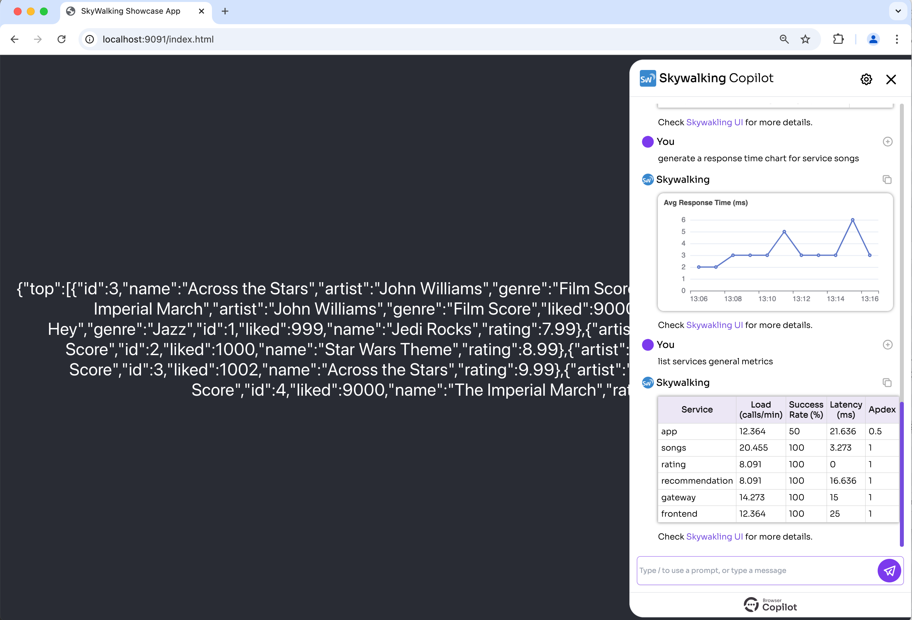

# Skywalking Copilot

A [Browser Copilot](https://github.com/abstracta/browser-copilot) that empowers the usage of applications that use [Apache Skywalking](https://skywalking.apache.org/) as an observability platform.



Currently, this project only covers some basic scenarios. If you are interested in helping to evolve it, we are open to contributions. 

## Features

* 🤖 Automatic activation of the agent when the configured application is accessed in a browser.
* 🚨 Proactive notifications of live alerts.
* 🕵️‍♂️ Proactive report of traces generated from the application in the active browser tab.
* 🗺️ Provide services topology diagram.
* 🧾 Provide a table of the services and their associated metrics.
* 📉 Generate charts of metrics like response time, error rate, load, Apdex, and message queuing metrics.
* 🤔 Ask any question about displayed information.
* ➕ More to come!

## Requirements

* [devbox](https://www.jetpack.io/devbox)

## Setup

```bash
devbox install && devbox run install
```

Set `OPENAI_API_KEY` with proper value in [.env](./.env)

Start Postgres:

```bash
devbox run postgres
```

## Development

To update to the latest version of the browser-copilot submodule, you can use

```bash
devbox run update-git
```

To update to the latest dependencies of the Python project:

```bash
devbox run update-python
```

To add new dependencies to the Python project:

```bash
poetry add X
```

To generate new DB migrations due to changes in the `database.py` module:

```bash
devbox run new-migration "description"
```

To run DB migrations against the local database:

```bash
devbox run migrations
```

> The app automatically updates the database with migrations when the Postgres service is started with devbox

To update the Skywalking showcase run:

```bash
devbox run update-showcase
```

## Skywalking Showcase

To try the copilot locally, try [Skywalking showcase](https://skywalking.apache.org/docs/skywalking-showcase/next/readme/#quick-start). 

This project already includes a tuned version of the showcase. You can build it with `devbox run update-showcase` and run it with `devbox run showcase`.

This will spin up the Skywalking showcase locally with minimum services and memory required, as well as showcase app frontend access from host and English song names.

Here is a diagram of the deployed infrastructure:


* To access Skywalking frontend go to `http://localhost:9999`. You can now explore information collected by Skywalking on the showcase sample services.

> To stop the showcase, you can run `devbox run stop-showcase`.

## Run agent in dev mode

```bash
devbox run agent
```

**Note:** The agent is configured by default to connect to `http://localhost:9999` to the Skywalking server and auto-trigger the copilot when the application under test is located at `http://localhost:9091`. If you want to try it with another Skywalking instance and application instance, change the [.env](./.env) file accordingly.

## Run Chrome extension in dev mode

```bash
devbox run browser
```

Now, if you open a new tab and navigate to the configured application monitored by skywalking (`http://localhost:9091/index.html`) the copilot should automatically activate, and you can start interacting with it.
